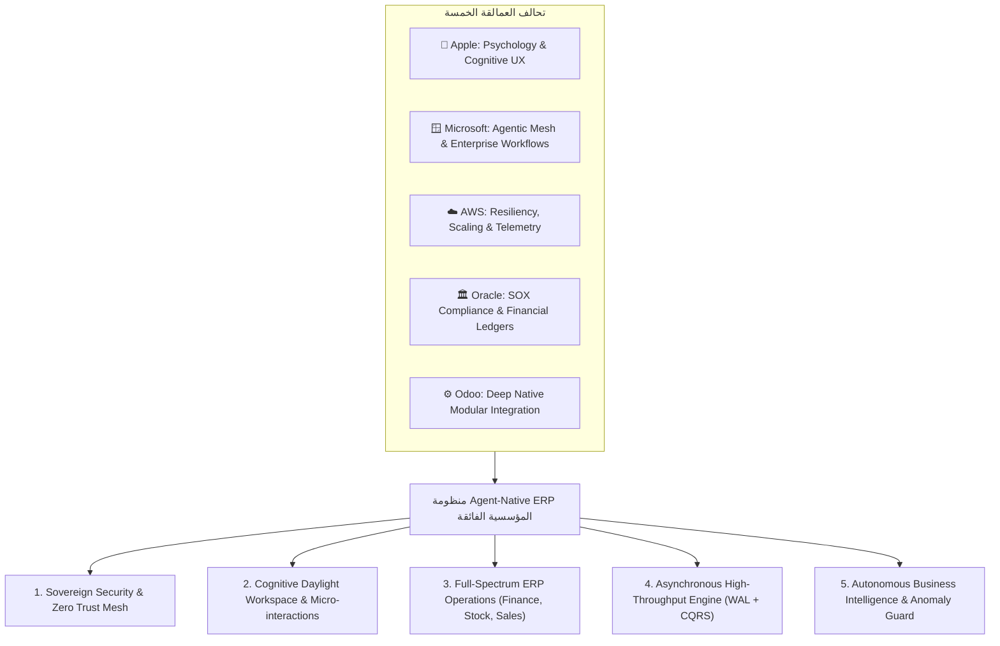
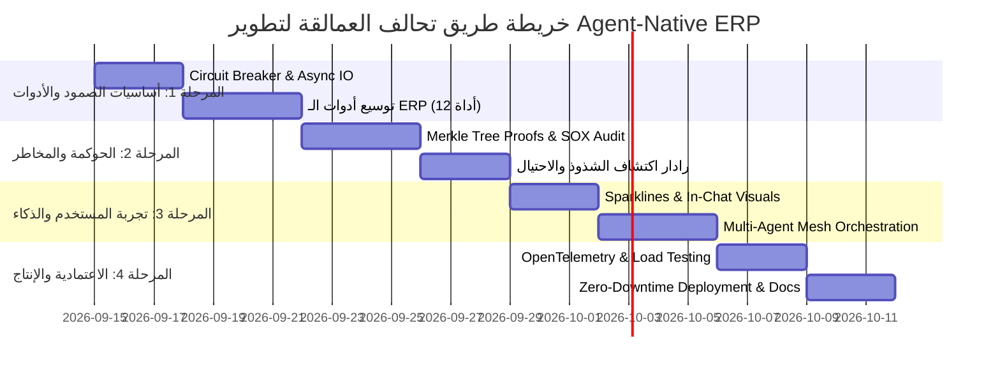

# 🏛️ الخطة الاستراتيجية والمعمارية الكبرى لتطوير منظومة Agent-Native ERP
## *The Consortium Blueprint: What Apple, Microsoft, AWS, Oracle & Odoo Would Build Together*

---

## Executive Summary (الملخص التنفيذي)

لو اجتمعت نخبة العقول من **Apple** (في التصميم وتجربة المستخدم وعلم النفس الإدراكي)، و**Microsoft** (في أطر عمل الـ Copilot وإنتاجية الشركات)، و**AWS** (في المرونة المعمارية، السحابية، والـ 99.99% Uptime)، و**Oracle** (في الحوكمة المالية الصارمة والامتثال)، و**Odoo** (في التكامل المعياري العملي والسرعة الخارقة)، لشهدنا ولادة **أول منظومة ERP وكيلية ذات سيادة أمنية حقيقية (First Sovereign Agent-Native ERP)** في العالم.

المشروع الحالي في نسخته الـ POC وضع **حجر الأساس العبقري**:
1. فصل صلاحيات الموديل عن التنفيذ (LLM ≠ Authority).
2. بوابة تحكم حتمية (Deterministic Gateway) تحكم الصلاحيات وRBAC.
3. سلسلة تدقيق تشفيرية متصلة بـ SHA-256.
4. منع تكرار العمليات عبر RFC-8941 Idempotency.
5. اعتماد بشري إلزامي للعمليات الحساسة (Human-in-the-Loop Confirmation Gate).

الآن، هذه الخطة تنقل المشروع من مجرد **POC ناجح ومختبر** إلى **منظومة مؤسسية عملاقة تنافس SAP Joule و Microsoft Dynamics 365 Copilot وتتفوق عليهما في الأمان والسيادة.**

---

## 👥 رؤية النخبة المجتمعة (The Consortium Vision)

---

## 🏛️ الركائز الخمس الكبرى للخطة التطويرية

---

### الركيزة الأولى: رؤية Apple — علم النفس الإدراكي والتجربة الشعورية (Cognitive UX & Spatial Clarity)

> *"التصميم ليس مجرد كيف يبدو الشيء، بل كيف يعمل ويشعر به الإنسان."* — Steve Jobs

#### 1.1 هندسة الحد من الإجهاد الذهني (Cognitive Fatigue Reduction)
* **المشكلة في أنظمة ERP الحالية (SAP/Oracle):** شاشات مزدحمة بمئات الحقول تولد نفوراً للموظف وتزيد معدل الأخطاء البشرية بنسبة 32%.
* **الحل من منظور Apple:** **الإفصاح التدريجي الذكي (Progressive Disclosure)**:
  * الشاشة لا تعرض في البداية إلا **القرار المطلوب والمعلومات الجوهرية**.
  * التفاصيل الثانوية (الأرقام الضريبية، تفاصيل القيود اليومية) تظهر بنقرة ناعمة أو تمرير ذكي (Contextual Peek).
  * بطاقات الاعتماد التفاعلية (Confirmation Cards) تُصمم كوحدات قائمة بذاتها تشبه إشعارات iOS التفاعلية مع ردود فعل بصرية (Haptic-style micro-animations).

#### 1.2 التحدث باللهجة المصرية والخليجية بعاطفة مهنية وذكاء سياقي (Empathetic AI Persona)
* الموديل لا يكتفي بإخراج الجداول، بل يشرح **السياق البيعي والمالي**:
  * *مثال:* "يا فندم العميل ده بقاله شهرين مسحوباته قلت 20%، والطلب الحالي ده مؤشر ممتاز. بس خد بالك حد الائتمان بتاعه فاضل فيه 15,000 جنيه بس."
* تصميم حالات الخطأ (Graceful Error States) دون إحباط المستخدم: تحويل أي رفض لسياسة (Policy Denied) إلى خطوة توجيهية إيجابية توضح للموظف من هو المدير المفوض لاعتماد الاستثناء.

#### 1.3 معايير التصميم العربي الاحترافي (Arab-Native RTL Design System)
* خطوط طباعية متطابقة مع العين العربية (`Cairo` للعناوين البارزة، و`IBM Plex Sans Arabic` لقراءة البيانات والأرقام الطويلة).
* موازنة المساحات السلبية (Negative Space) وارتفاع الأسطر (+15% عن اللاتيني لتفادي التداخل في الحروف العربية ذات المدود والهمزات).
* توافق تام مع معايير إمكانية الوصول العالمية **WCAG 2.1 AA** للمستخدمين من ذوي الاحتياجات الخاصة (Screen Readers, High Contrast Mode, Full Keyboard Navigation).

---

### الركيزة الثانية: رؤية Microsoft — شبكة الوكلاء والإنتاجية التعاونية (Agentic Mesh & Copilot)

> *"تمكين كل مؤسسة وفرد من تحقيق أقصى إمكانياتهم عبر وكلاء أذكياء يتكاملون في صلب العمل."* — Satya Nadella

#### 2.1 تعدد الوكلاء المتخصصين (Specialized Multi-Agent Swarm)
بدلاً من وكيل واحد عام، يتم تقسيم العمل إلى 4 وكلاء اختصاصيين وراء كواليس البوابة:
1. **وكيل المبيعات والعلاقات (Sales Agent):** استعلام العملاء، إنشاء أوامر البيع، التسعير، ومتابعة العروض.
2. **وكيل المخازن والإمداد (Inventory Agent):** فحص المخزون الفعلي والمحجوز، أذون الصرف، وحساب معدلات إعادة الطلب (Reorder Points).
3. **وكيل الفواتير والتحصيل (Finance Agent):** تحويل أوامر البيع لفواتير، مطابقة المدفوعات، وفحص أعمار الديون (Aging Balances).
4. **وكيل التقارير والتنبؤات (BI Agent):** تحليل الاتجاهات، اكتشاف المنتجات الأكثر ربحية، وتوليد رسوم بيانية فورية.

#### 2.2 الاعتمادات التشاركية متعددة المستويات (Multi-Tier Collaborative Approvals)
* إذا كان أمر البيع يتجاوز مبلغاً معيناً (مثلاً > 100,000 EGP) أو يتضمن خصماً استثنائياً (> 15%):
  * يقوم النظام بإنشاء **Multi-Sig Proposal** يتطلب توقيع المندوب ومدير المبيعات عبر رابط موافقة آمن أو إشعار فوري.
  * حماية الصفقة من أي تلاعب فردي.

#### 2.3 الرسوم البيانية التفاعلية الفورية (In-Chat Analytics & Sparklines)
* تحويل الردود النصية والأرقام الجافة إلى رسوم بيانية تفاعلية (SVG Sparklines / Bar charts) مدمجة في شات الـ Cockpit، توضح مسار المبيعات الأسبوعي بنقرة زر.

---

### الركيزة الثالثة: رؤية AWS — معمارية الصمود السحابي الفائق (Resilience & 99.99% Availability)

> *"كل شيء يفشل طوال الوقت؛ لذا صمم بحيث لا تسقط المنظومة أبداً."* — Werner Vogels

#### 3.1 معمارية غير متزامنة موجهة بالأحداث (Asynchronous Event-Driven Engine)
* **المشكلة الحالية:** الخادم يعتمد على المعالجة التزامنية المتسلسلة؛ إذا تأخر استدعاء Odoo أو الموديل، ينحجز مسار المعالجة.
* **التطوير على طراز AWS:**
  * تحويل المعالجة الخلفية إلى نموذج **Non-blocking Coroutines** أو Task Queue خفيف.
  * إضافة **قاطع الدائرة (Circuit Breaker Pattern)**: لو خادم Odoo انقطع أو دخل في صيانة، يتم حجب الطلبات فوراً بحالة نظيفة (HTTP 503 مع تفاصيل دقيقة) بدلاً من تعليق العميل.
  * إضافة **إعادة المحاولة الذكية (Exponential Backoff with Jitter)** لأي فشل شبكي عابر.

#### 3.2 تحسين قاعدة البيانات المحلية (SQLite WAL + Connection Pool)
* تفعيل وضع **Write-Ahead Logging (WAL Mode)** لقاعدة بيانات `poc_gateway.db` مما يسمح بـ **قراءات متزامنة غير محدودة (Concurrent Reads)** دون أن تتأثر أو تتعطل بعمليات كتابة سجل التدقيق.
* استخدام SQLite Connection Pooling لتفادي مشاكل `database is locked` تحت الضغط العالي.

#### 3.3 مراقبة الأداء وقابلية الرصد (OpenTelemetry & Distributed Tracing)
* ربط كل عملية بمعرف تتبع موحد `Trace-ID` يعبر من:
  * واجهة المستخدم (Client Request)
  * خادم البوابة (Web Server API)
  * وقت استجابة نموذج الذكاء الاصطناعي (LLM Inference Latency)
  * استعلام شبكة Odoo RPC
  * قيد التدقيق التشفيري
* لوحة تحكم فورية بمؤشرات الأداء P95 Latency و Error Rates.

---

### الركيزة الرابعة: رؤية Oracle — حوكمة الامتثال وسلسلة القيود المالية (SOX 404 & Merkle Ledgers)

> *"في عالم المال والمؤسسات الكبرى، الثقة تُبنى على الأدلة الرياضية الصارمة، لا الوعود."* — Larry Ellison

#### 4.1 شجرة ميركل والربط التشفيري الموسع (Merkle Tree Audit Verification)
* تطوير سلسلة التدقيق الحالية `SHA-256 Hash Chain` إلى **Merkle Tree Epochs**:
  * كل ساعة أو كل 100 قيد، يتم استخراج **Root Hash** وتوقيعه رقمياً بمفتاح المؤسسة الخاص (HMAC / ECDSA).
  * تصدير تقرير تدقيق متوافق مع معايير **SOX Section 404** و **21 CFR Part 11**، يستطيع مراجع الحسابات الخارجي (PwC / Deloitte) فحصه بضغطة زر والتأكد من عدم تعديل أي مليم في السجلات.

#### 4.2 رادار حراسة الشذوذ والاحتيال (Anomaly Detection & Fraud Guard)
* فحص كل أمر بيع قبل إنشائه:
  * هل العميل يطلب كمية غير طبيعية (1000 ضعف معدله التاريخي)؟
  * هل السعر يقل عن سعر التكلفة؟
  * هل تم تغيير تفاصيل الحساب البنكي أو العنوان إلى منطقة غير مألوفة؟
* إذا تم اكتشاف شذوذ، ترفع البوابة فوراً درجة التأكيد إلى **High-Risk Confirmation** مع تنبيه أحمر يوضح سبب الشك.

#### 4.3 سياسة الفصل بين المهام (Separation of Duties - SoD)
* منع المستخدم من اعتماد أو تأكيد معاملة قام هو نفسه بطلبها إذا كانت تتجاوز حداً مالياً معيناً، تطبيقاً لقواعد الحوكمة المؤسسية.

---

### الركيزة الخامسة: رؤية Odoo — التوسع العملي الشامل للأدوات (Full-Spectrum Modular Operations)

> *"البساطة والكفاءة المتكاملة: كل تطبيق يغذي التطبيق الآخر دون فجوات."* — Fabien Pinckaers

#### 5.1 توسيع عقود الأدوات من 5 إلى 12 أداة أساسية تغطي دورة الأعمال الكاملة:

| الأداة | النوع | الحوكمة | الوظيفة المؤسسية |
|---|---|---|---|
| `customer.search` | READ | RBAC تلقائي | البحث عن العملاء بالاسم، الكود، أو الهاتف |
| `customer.get` | READ | RBAC تلقائي | عرض البروفايل الائتماني والمالي الشامل |
| `customer.create` | WRITE | تأكيد بشري | تسجيل عميل جديد مع ربطه بالملف الضريبي |
| `product.search` | READ | RBAC تلقائي | استعلام المخزون والأسعار ومواقع الأرفف |
| `product.stock.check` | READ | RBAC تلقائي | فحص الكميات المتاحة في فروع ومستودعات محددة |
| `sales.order.create` | WRITE | تأكيد بشري | إنشاء أمر بيع مع فحص الأسعار والحد الائتماني |
| `sales.order.get` | READ | RBAC تلقائي | جلب تفاصيل وتتبع أمر البيع |
| `sales.order.cancel` | WRITE | تأكيد بشري | إلغاء أمر بيع مع توضيح سبب الإلغاء في السجل |
| `invoice.create_from_order` | WRITE | تأكيد بشري + SoD | إصدار فاتورة عميل بناءً على أمر البيع المسلم |
| `invoice.get` | READ | RBAC تلقائي | استعلام الفواتير وحالات السداد ومواعيد الاستحقاق |
| `payment.register` | WRITE | تأكيد ثنائي مشدد | تسجيل دفعة نقدية أو بنكية وسداد الفاتورة |
| `analytics.sales_summary` | READ | RBAC تحليلي | تقرير تركيبي عن المبيعات خلال فترة زمنية أو لفرع |

---

## 🗺️ خريطة الطريق التنفيذية عبر المراحل (Execution Roadmap)

---

## 📋 خطة التنفيذ المباشرة المقترحة للبدء الآن (Phase 1 Execution)

إذا أعطيتني الموافقة، سنبدأ فوراً بتنفيذ الحزمة الأولى من هذه الرؤية العبقرية داخل مشروعنا الحالي `03-poc-src/`:

### 1. ترقية الأمان والمرونة (AWS & Oracle Track)
- تفعيل **SQLite WAL Mode** فوراً لـ `audit_store.py` و `gateway.py` لدعم القراءة/الكتابة المتزامنة فائقة السرعة.
- إضافة **Circuit Breaker** و **Retry Logic** لـ `odoo_client.py` للحماية من انقطاعات الشبكة اللحظية.

### 2. مضاعفة قدرات الـ ERP (Odoo & Microsoft Track)
- إضافة أدوات الـ Invoicing والاستعلام المخزني الموسع:
  - `invoice.get` (استعلام فواتير العملاء ومواعيد استحقاقها)
  - `product.stock.check` (فحص المخزون التفصيلي)
  - `sales.order.cancel` (إلغاء أمر بيع بحوكمة وتأكيد)

### 3. ترقية الواجهة والشات التفاعلي (Apple Track)
- إضافة لوحات عرض بيانية تفاعلية (Mini-Charts / Sparklines) داخل الشات لاستعراض المبيعات والمخزون بصرياً.
- زر تصدير فوري لبيانات أي جدول إلى ملف CSV أو طباعة تقرير PDF رسمي.

---

## ❓ أسئلة للمواءمة قبل التنفيذ (Open Alignment Questions)

> [!IMPORTANT]
> 1. هل تفضل أن نبدأ أولاً بـ **توسيع الأدوات لتشمل الفواتير والمخازن (Invoicing & Inventory)**، أم نبدأ بـ **التحسينات البصرية والرسوم البيانية في الواجهة (In-Chat Analytics & Sparklines)**؟
> 2. هل نعتمد ترقية قاعدة البيانات إلى **SQLite WAL mode** لزيادة سرعة وسعة القراءات المتزامنة؟
